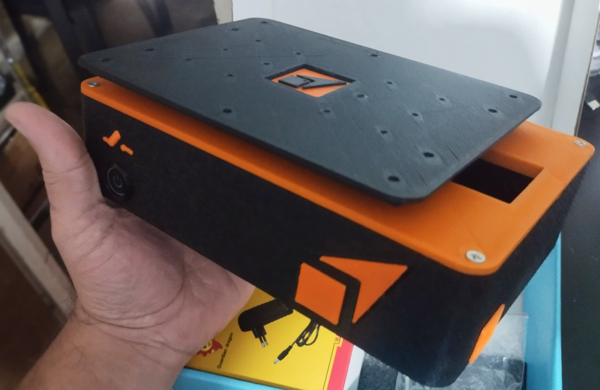

# Getting Started

Si en su poder se encuentra el Kit de experimentación e investigación **Platypus Shaker**, ¡Felicitaciones! Está en presencia de la mesa sísmica más portátil y accesible del mercado.

    
        Compra tu <em>Kit educativo de experimentación e investigación Platypus Shaker</em>   
        Por solo <strong style="color: rgb(105, 255, 35);">USD $198.90</strong>
         envio Gratis Colombia (Consulta disponibilidad)
    

 

    
    <a href="https://api.whatsapp.com/send?phone=573167164222&text=Hola!%20%0ADeseo%20ayuda%20con%20la%20compra%20de%20Platypus%20Shaker" style="background-color: rgb(255, 116, 35); color: white; text-decoration: none; font-weight: bold; border-radius: 0.9rem; width: 5rem; height: 100%; display: flex; align-items: center; justify-content: center;">
        Ayuda🛒 
    </a>

## 🔌 Pasos de Conexión y Primer Uso
Sigue estos pasos para conectar correctamente la mesa:

- **Conectar el cable de alimentación** a la fuente de 12V (incluida).
- **Crear un HotSpot**  
  **SSID:** platy  
  **Contraseña:** platy123

<a id="hotspot-link" href="ms-settings:network-mobilehotspot" style="display:none;" class="hotspot-button">
  Abrir configuración de Hotspot en Windows
</a>

- **Encender el interruptor principal** y verificar que el indicador LED esté encendido. Una vez conectado a la red WiFi, el LED verde dejará de parpadear.
- **Abrir el software de control**  
  En el navegador web, ir a `platyshaker.local`. Si es su primer uso, le pedirá la clave de activación, que se encuentra en la tarjeta de garantía del dispositivo.
- **Realizar la primera prueba**  
  Ingrese a la función sinusoidal y presione el botón **Iniciar**. La mesa realizará una calibración y centrado inicial automático antes de ejecutar la función.

Si la mesa no responde, revisa la sección de [Solución de Problemas](mantenimiento.md).

¡Explora la documentación para más detalles! 🚀

<!--mkdocs serve -->  